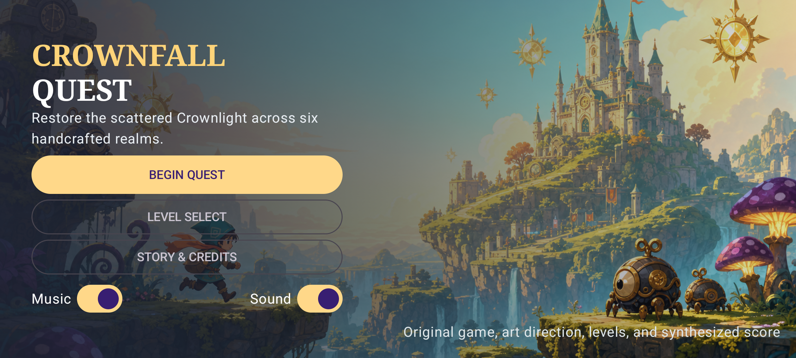
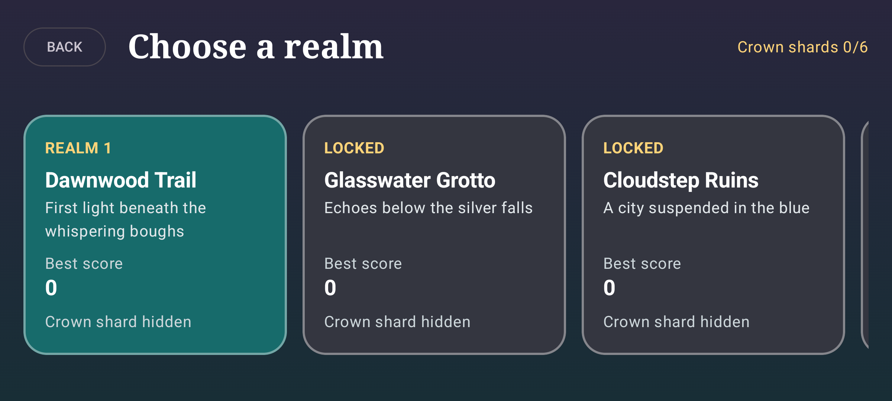
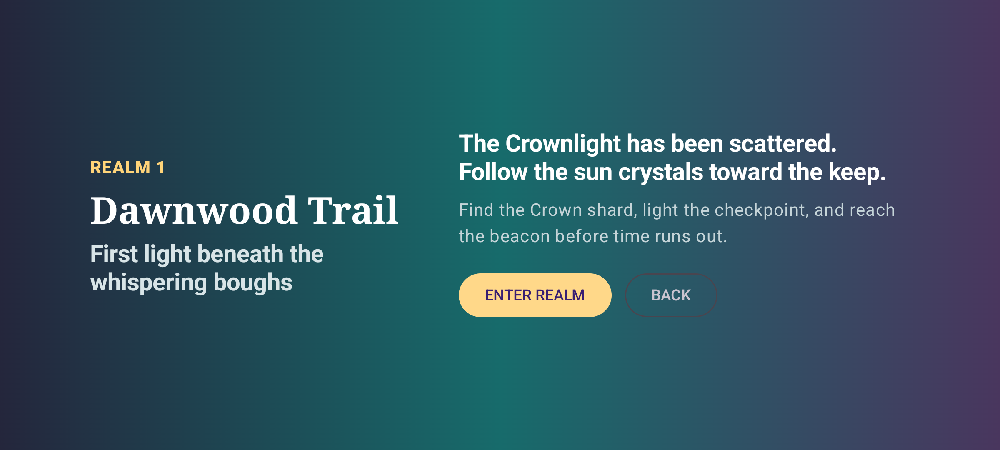
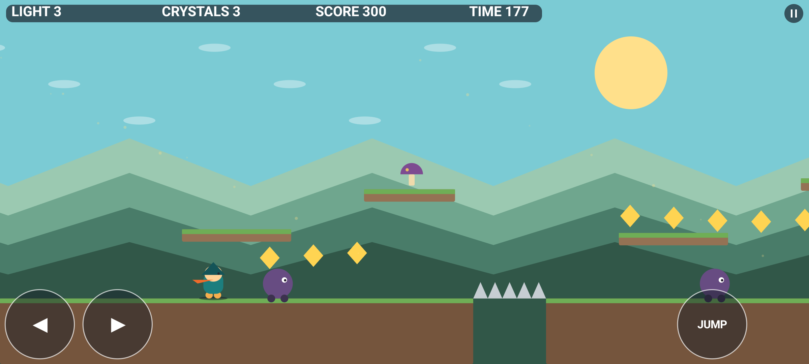
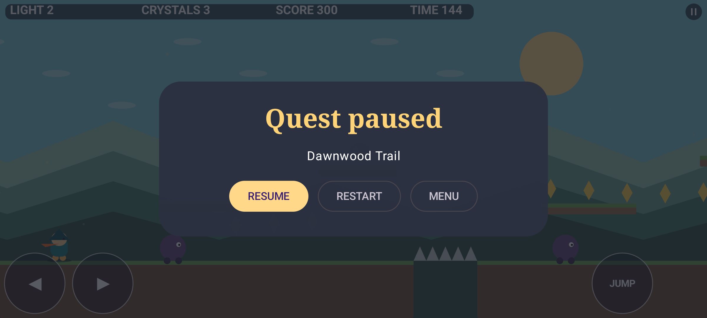

# Crownfall Quest

Crownfall Quest is an original landscape Android platformer built with Kotlin, Compose, and a custom Canvas game renderer. It borrows genre mechanics such as running, jumping, growth power-ups, projectile combat, score chasing, secrets, and multi-level progression while using original characters, levels, art, names, and music.

## Features

- Six themed levels with checkpoints, secrets, hazards, moving platforms, and a final boss
- Three hero forms: scout, guardian, and ember guardian
- Touch, keyboard, and game-controller input
- Deterministic fixed-step simulation and data-driven level definitions
- Animated original characters and procedural effects
- Original synthesized soundtrack and sound effects
- Local progress, best scores, level unlocks, pause, restart, and level select
- Unit, integration, Compose UI, and device smoke tests with Jacoco coverage

## Screenshots

| Main menu | Level select |
| --- | --- |
|  |  |

| Realm story | Gameplay |
| --- | --- |
|  |  |



## Build

```bash
./gradlew :app:assembleDebug
./gradlew :app:testDebugUnitTest jacocoTestReport
./gradlew :app:connectedDebugAndroidTest
```

Current release verification: 38 local tests, 3 device tests, successful Jacoco report, successful debug APK build, and emulator gameplay review.

See [docs/IMPLEMENTATION_PLAN.md](docs/IMPLEMENTATION_PLAN.md) and [docs/testing.md](docs/testing.md).

## Intellectual property

This project does not include Nintendo names, characters, music, graphics, code, or copied level layouts. All shipped content is original to Crownfall Quest.
